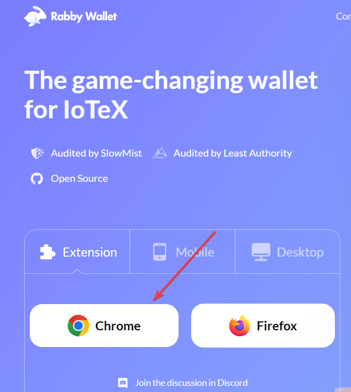

## 🔧 Step-by-Step: Set Up Rabby Wallet (Desktop)
### ✅ 1. Install Rabby Extension
* Visit: https://rabby.io

* Click “Download Extension”

* Choose Chrome (for Brave too) / Firefox (compatible browsers)

    

>📦 It’s fully open-source and safer than MetaMask for DeFi.

### ✅ 2. Create a New Wallet
* en the Rabby extension after install

* Click “Create Wallet”

* Set a strong password (write this down securely)

* Back up your 12-word recovery phrase

* Write it by hand, do not store it digitally (for now)

* You’ll migrate to Trezor later and won’t need this wallet for long-term storage

### ✅ 3. Select Networks to Enable
Rabby supports multi-chain automatically, but you can enable:

* ✅ Ethereum

* ✅ Arbitrum

* ✅ Polygon

* ✅ Base

* ✅ BNB Chain

* ✅ Optimism
(You can add more later)

### ✅ 4. Add Some USDC (Optional for Testing)
You can:

* Receive USDC from an ATM, exchange, or friend

* Or simulate/test with tiny amounts

Use Arbitrum or Polygon for low gas fees

### ✅ 5. Bookmark Your Wallet Address
This is your public address. You can now:

* Receive funds (e.g., from ATM or on-ramp)

* Connect to DEXs like Uniswap, 1inch, or Curve

* Swap, bridge, or interact with DeFi

### 🔐 You’re Set!
This Rabby wallet is your temporary hot wallet.
